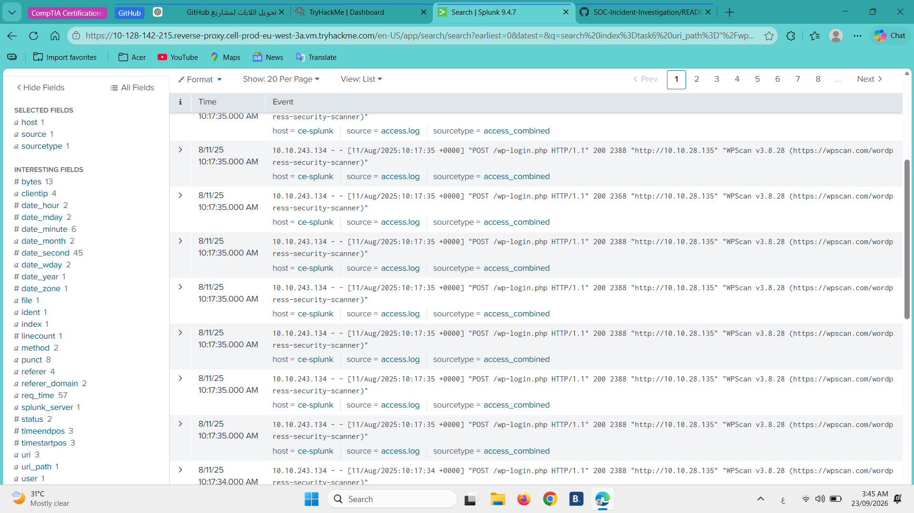

# SOC Incident Investigation

## Overview

This project documents a hands-on SOC investigation using Splunk to analyze security logs and identify suspicious activity.

The investigation was performed in a simulated environment as part of practical cybersecurity training.

## Objectives

- Analyze security logs using a SIEM
- Identify suspicious authentication and network activity
- Investigate potential brute-force attacks
- Identify indicators of compromise
- Document findings and recommended mitigations

## Tools & Technologies

- Splunk
- SIEM
- Windows Event Logs
- Linux Logs
- Web/Apache Access Logs
- TryHackMe Lab Environment

## Investigation Areas

- Windows log analysis
- Linux authentication analysis
- Web log analysis
- Brute-force detection
- Suspicious process investigation
- Persistence analysis

## Key Findings

The investigation identified several suspicious activities, including:

- Brute-force activity targeting a WordPress login endpoint
- Suspicious process execution
- Suspicious account activity
- Persistence through a scheduled task
- Suspicious web requests

## Skills Demonstrated

- Log Analysis
- SIEM Investigation
- Incident Detection
- Threat Investigation
- IOC Identification
- Basic Incident Response
- Security Documentation

## Evidence

### WPScan Web Attack Investigation

Evidence from Splunk showing repeated requests to the WordPress login endpoint and identification of WPScan as the User-Agent.

## Project Files

- [Investigation Report](Investigation-Report.md)
- [Indicators of Compromise](./findings/indicators-of-compromise.md)
