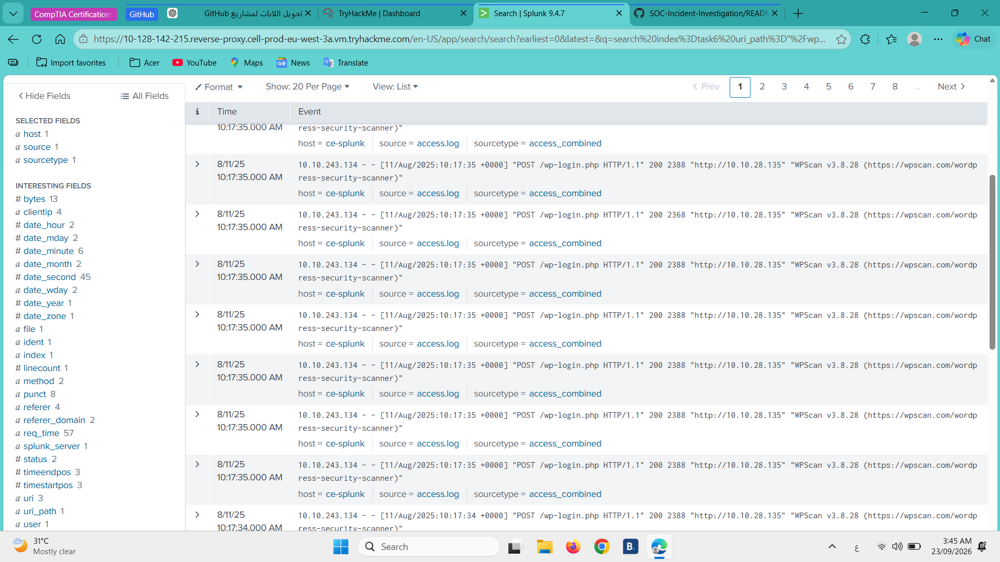

# 🛡️ SOC Incident Investigation: Web Attack & Reconnaissance with Splunk

**Author:** Farah Samer

**GitHub Repository:** https://github.com/FarahSamer-eng/SOC-Incident-Investigation

**LinkedIn:** [Farah Samer](https://www.linkedin.com/in/farah-samer-b35201386)

**Role / Focus:** SOC Analyst / Threat Detection & Incident Response

---

## 📌 Executive Summary

This project documents an end-to-end SOC incident investigation using **Splunk Enterprise** to analyze web access logs, authentication events, and host-level system telemetry within a simulated enterprise environment.

The investigation uncovered an automated reconnaissance and credential brute-forcing campaign targeting a web server hosting WordPress (`/wp-login.php`). By querying Splunk using `sourcetype=access_combined` and correlating HTTP request traffic, source IP telemetry, and User-Agent signatures, the investigation identified automated scanning activity associated with **WPScan**, isolated the attacker source IP (`10.10.243.134`), and mapped the observed behaviors to the MITRE ATT&CK framework.

---

## 🎯 Objectives

* **SIEM Analysis & Log Search:** Utilize Splunk SPL (Search Processing Language) to query `access_combined` web logs and system telemetry.
* **Threat Identification:** Detect automated vulnerability scanning and credential brute-force activity targeting web application endpoints.
* **User-Agent & Artifact Analysis:** Extract technical indicators such as User-Agent strings, request paths, HTTP response codes, and source IPs.
* **Attack Reconstruction:** Chronologically analyze malicious traffic to establish attack activity and scope.
* **Threat Mapping:** Align observed attack behaviors with the **MITRE ATT&CK** framework.
* **Defensive Guidance:** Document Indicators of Compromise (IOCs) and security hardening recommendations.

---

## 🛠️ Tools & Technologies

* **SIEM Platform:** Splunk Enterprise v9.4.7
* **Query Language:** Search Processing Language (SPL)
* **Log Source:** Apache/Nginx Web Access Logs (`access_combined`)
* **Target Web Platform:** WordPress (`/wp-login.php`)
* **Attack Tooling Detected:** WPScan v3.8.28
* **Framework:** MITRE ATT&CK
* **Environment:** Controlled TryHackMe Cybersecurity Range

---

## 🔍 Investigation Workflow

```text
┌────────────────────────┐
│  Log Data Ingestion    │
│ Apache Access Logs     │
│ ingested into Splunk   │
└───────────┬────────────┘
            ▼
┌────────────────────────┐
│ Traffic Analysis       │
│ Filter access_combined │
│ & target URI endpoints │
└───────────┬────────────┘
            ▼
┌────────────────────────┐
│ User-Agent & IP        │
│ Analysis               │
│ Identify WPScan &      │
│ attacker source IP     │
└───────────┬────────────┘
            ▼
┌────────────────────────┐
│ Timeline Reconstruction│
│ Analyze POST frequency │
│ & HTTP status codes    │
└───────────┬────────────┘
            ▼
┌────────────────────────┐
│ Response & Hardening   │
│ IOCs & security        │
│ recommendations        │
└────────────────────────┘
```

---

## 🚨 Incident Investigation & Evidence Analysis

### 1. Web Access Log Correlation

A Splunk search was used to identify high-volume HTTP requests and suspicious request signatures:

```spl
index=* sourcetype=access_combined host=ce-splunk
| stats count by clientip, uri_path, http_method, useragent, status
| sort - count
```

### 2. Key Findings

* **Attacker Source IP:** `10.10.243.134`
* **Target Host IP:** `10.10.28.135`
* **Target Endpoint:** `/wp-login.php`
* **HTTP Method:** `POST`
* **User-Agent:** `WPScan v3.8.28`
* **HTTP Status Code:** `200`
* **Response Size:** `2388 bytes`
* **Log Source:** `source=access.log`
* **Sourcetype:** `access_combined`

---

## ⏱️ Attack Timeline

| Timestamp (UTC)       | Source IP       | Target IP      | Method / URI         | Observed Activity                                    |
| --------------------- | --------------- | -------------- | -------------------- | ---------------------------------------------------- |
| `2025-08-11 10:17:34` | `10.10.243.134` | `10.10.28.135` | `POST /wp-login.php` | Automated WPScan request initiated                   |
| `2025-08-11 10:17:35` | `10.10.243.134` | `10.10.28.135` | `POST /wp-login.php` | High-frequency login activity associated with WPScan |
| `2025-08-11 10:17:35` | `10.10.243.134` | `10.10.28.135` | `POST /wp-login.php` | Credential guessing sequence observed                |

---

## 🛡️ MITRE ATT&CK Mapping

| Tactic                | Technique Name                          | Tech ID     | Observed Evidence                                             |
| --------------------- | --------------------------------------- | ----------- | ------------------------------------------------------------- |
| **Reconnaissance**    | Active Scanning: Vulnerability Scanning | `T1595.002` | Automated WPScan activity targeting the WordPress application |
| **Credential Access** | Brute Force: Password Guessing          | `T1110.001` | Repeated HTTP POST requests targeting `/wp-login.php`         |

---

## 📊 Indicators of Compromise (IOCs)

| Indicator        | Type         | Description                                                                   |
| ---------------- | ------------ | ----------------------------------------------------------------------------- |
| `10.10.243.134`  | IPv4 Address | Source IP associated with automated scanning and credential-guessing activity |
| `/wp-login.php`  | URI Path     | Target WordPress authentication endpoint                                      |
| `WPScan v3.8.28` | User-Agent   | User-Agent associated with the detected WPScan activity                       |

---

## 📋 Recommended Remediation & Hardening

### 1. Immediate Containment

* **IP Blocking:** Add `10.10.243.134` to appropriate firewall and WAF blocklists.
* **Session Management:** Review and terminate suspicious administrative sessions associated with the attack window.

### 2. Web Application Hardening

* **Rate Limiting:** Apply rate limits to `/wp-login.php` to reduce automated credential-guessing attempts.
* **WAF Rules:** Create rules to detect and restrict known automated scanner signatures where appropriate.
* **Multi-Factor Authentication:** Require MFA for WordPress administrative and privileged accounts.
* **Login Protection:** Implement CAPTCHA or dedicated login protection mechanisms.

### 3. Monitoring & Alerting

Create a scheduled Splunk detection for abnormal authentication activity, for example:

```spl
index=* sourcetype=access_combined uri_path="/wp-login.php" http_method=POST
| stats count by clientip
| where count > 50
```

This threshold can be further tuned according to the normal traffic baseline of the environment.

---

## 🖼️ Investigation Evidence & Screenshots

### WPScan Web Attack Detection in Splunk



*Figure 1: Splunk search results displaying repeated HTTP POST requests from `10.10.243.134` to `/wp-login.php` using the WPScan User-Agent.*

---

## 💡 Skills Demonstrated

* SIEM Investigation & Splunk Querying (SPL)
* Web Server Access Log Analysis
* Web Application Attack & Brute-Force Identification
* User-Agent & HTTP Request Analysis
* IOC Extraction
* Attack Timeline Reconstruction
* MITRE ATT&CK Threat Mapping
* Defensive Hardening
* Incident Documentation

---

## ⚠️ Disclaimer & Environment

This project was conducted in a controlled **TryHackMe** cyber range environment for educational, training, and security research purposes.

All IP addresses and log telemetry represent simulated environment traffic and should not be interpreted as evidence of activity within a real production environment.
